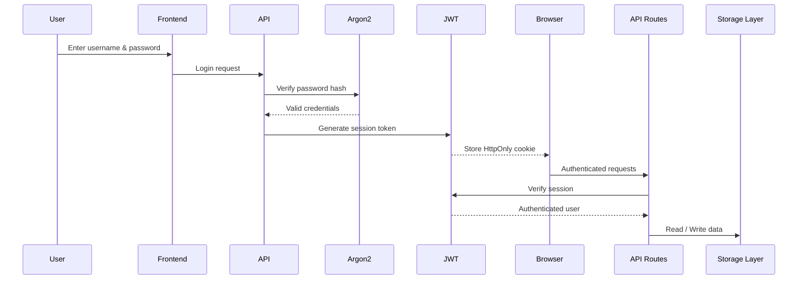
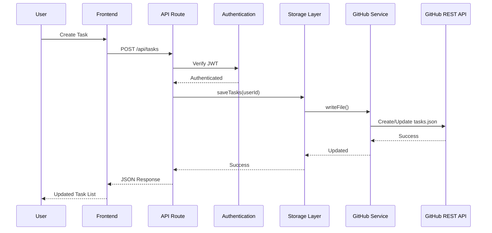

# HabitForge Lite

HabitForge Lite is a professional productivity application designed to manage personal workflows. The system is built on Next.js and utilizes GitHub repository architecture to store application state and user records without relying on traditional databases.

## Key Capabilities

* Cloud Database Integration
  HabitForge Lite implements GitHub as a cloud database. All personal data is saved in structured files inside a private repository. This structure removes the necessity of external hosting services for databases and ensures complete ownership of your data.

* Categories
  Users can group their activities into broad categories. Each category supports customizable color coding and icon designations for clear visual separation.

* Subcategories
  Every main category supports further organization through subcategories. This hierarchical structure enables precise grouping of tasks under specific parent domains.

* Tasks
  The task engine supports complete creation, retrieval, updates, and deletion. Tasks include parameters for priority levels, estimated durations, and text searching.

* Timers
  An integrated focus timer tracks session durations. Users can initiate countdown sessions and save completed intervals directly to their history.

* Analytics
  A data visualization suite displays weekly progress and activity density. Users can view category distributions and daily completion performance.

## System Architecture

HabitForge Lite follows a serverless architecture built with **Next.js**, using a **private GitHub repository as its persistent data store**. Instead of relying on traditional databases such as PostgreSQL or MongoDB, the application stores structured JSON files inside a GitHub repository and manages them through the GitHub REST API using **Octokit**.

The application follows a layered architecture consisting of the frontend, API routes, authentication layer, storage layer, and GitHub service. Every authenticated request passes through these layers before reading from or writing to the user's dedicated data directory inside the repository.

### High-Level Architecture

```mermaid
flowchart LR

A[User]
A --> B[Next.js Frontend]

B --> C[Next.js API Routes]

C --> D[Authentication Layer]
C --> E[Storage Layer]

D --> E

E --> F[GitHub Service (Octokit)]

F --> G[GitHub REST API]

G --> H[(Private GitHub Repository)]
```
### Component Overview

| Component                     | Responsibility                                                                                 |
| ----------------------------- | ---------------------------------------------------------------------------------------------- |
| **Next.js Frontend**          | Provides the user interface for managing categories, tasks, timers, and analytics.             |
| **API Routes**                | Handle CRUD operations, validate requests, and coordinate interactions with the storage layer. |
| **Authentication Layer**      | Verifies user credentials using Argon2 and protects API routes using JWT-based sessions.       |
| **Storage Layer**             | Manages reading and writing structured JSON data for each authenticated user.                  |
| **GitHub Service**            | Uses Octokit to communicate with the GitHub REST API for repository operations.                |
| **Private GitHub Repository** | Stores all application data as version-controlled JSON files.                                  |

### GitHub as Database Workflow

Instead of using a conventional database server, HabitForge Lite stores application data inside a private GitHub repository. The storage layer communicates with GitHub through Octokit, allowing the application to retrieve, create, update, and organize structured JSON files while leveraging GitHub's version control capabilities.

The storage layer performs the following operations:

* Reads JSON files from the repository.
* Creates missing files automatically during first use.
* Creates or updates JSON files through the GitHub REST API. Every successful modification becomes a Git commit, providing built-in version history and traceability.
* Retrieves existing data for authenticated users.
* Organizes all user data in isolated directories.

This approach removes the need for database hosting while leveraging GitHub's infrastructure for persistence and version history.

### Authentication Flow

Authentication is implemented using secure password hashing and JWT-based sessions.



The authentication process consists of:

1. The user submits a username and password.
2. Passwords are verified using Argon2.
3. A signed JWT session token is generated after successful authentication.
4. The JWT is stored as an HttpOnly cookie.
5. Every protected API route validates the session before accessing user data.
6. Only authenticated users can perform repository operations.
   
Once authenticated, the session remains valid until expiration or logout. Every protected API route verifies the stored JWT before allowing read or write operations on the user's data.

### Data Storage Structure

Each authenticated user has a dedicated directory inside the private GitHub repository. This user-specific structure keeps categories, tasks, logs, and profile information isolated while simplifying data management and retrieval.

```text
data/
└── users/
    └── <userId>/
        ├── profile.json
        ├── categories.json
        ├── subcategories.json
        ├── tasks.json
        └── logs/
            ├── 2026-06-24.json
            ├── 2026-06-25.json
            └── ...
```

**Stored files**

* **profile.json** – User profile information.
* **categories.json** – Top-level task categories.
* **subcategories.json** – Nested organization for categories.
* **tasks.json** – Task records and metadata.
* **logs/** – Daily productivity and timer logs stored as date-based JSON files.

This user-specific directory structure ensures that application data remains isolated between users while maintaining a simple and organized repository layout.
When data is requested for the first time, the storage layer automatically initializes any missing JSON files with default content. This ensures a consistent repository structure without requiring manual file creation.

### Request Lifecycle

The following diagram illustrates how a typical request flows through the application.


### Data Flow Summary

1. The user performs an action in the frontend.
2. The frontend sends a request to a Next.js API route.
3. The API route validates the authenticated session.
4. The storage layer retrieves or updates the corresponding JSON file for the authenticated user.
5. The storage layer invokes the GitHub service, which communicates with the GitHub REST API using Octokit.
6. The requested JSON file is created or updated inside the user's dedicated directory in the private repository.
7. GitHub records the modification as a commit and returns the updated file information.
8. The API route sends the updated data back to the frontend, where the user interface is refreshed.

## Contribution Guidelines

We welcome contributions from the open source community. Please follow these steps to contribute to this project:

1. Fork the repository to your own account.
2. Select any active issue or propose enhancements.
3. Commit your changes and submit a pull request for review.

## Deployment and Setup

You can deploy your own instance of HabitForge Lite by following these four steps.

### Step 1: Fork the Repository

Begin by forking this repository to your personal GitHub account. This creates a copy of the codebase that you can deploy and modify.

### Step 2: Configure the GitHub API Token

You must generate an access token so the application can communicate with GitHub.
1. Navigate to Developer Settings on GitHub and create a personal access token using the classic option.
2. Ensure you select the repository scope for this token.
3. Configure the token expiration settings. If you choose a custom date instead of the never expire option, you must regenerate and update this token after the specified duration.

### Step 3: Initialize the Database Repository

Create another private GitHub repository, which will act as the database. This repository serves as the cloud database where the application writes categories, subcategories, tasks, and historical session logs.

### Step 4: Deploy and Configure Environment Variables

Connect your Vercel account with GitHub and deploy the frontend. Go to the environment variables section in Vercel. You can check the env.local.example file and copy the variable names from it. Put your own password, API token, GitHub owner identity, and database repository name:

* GITHUB_TOKEN
  The personal access token generated in the second step.

* GITHUB_OWNER
  Your GitHub username or organization identifier.

* GITHUB_REPO
  The name of the private repository created to store database files.

* APP_PASSWORD
  A custom password of your choice to restrict access to the application dashboard.

* JWT_SECRET
  A secure key used for signing session tokens.
